# Remote Access to Another Server

## _Before We Begin:_
Make sure that you have an IDE set up on your local machine. If you don't have one installed, no worries! A great IDE to use is Visual Studio Code. Here is the link to download it on to your computer: [https://code.visualstudio.com/](https://code.visualstudio.com/).

After you have it installed, and you click the Visual Studio code icon, this is what the window should look like (__Note:__ Depending on your system settings, menu bars and colors may look different.)

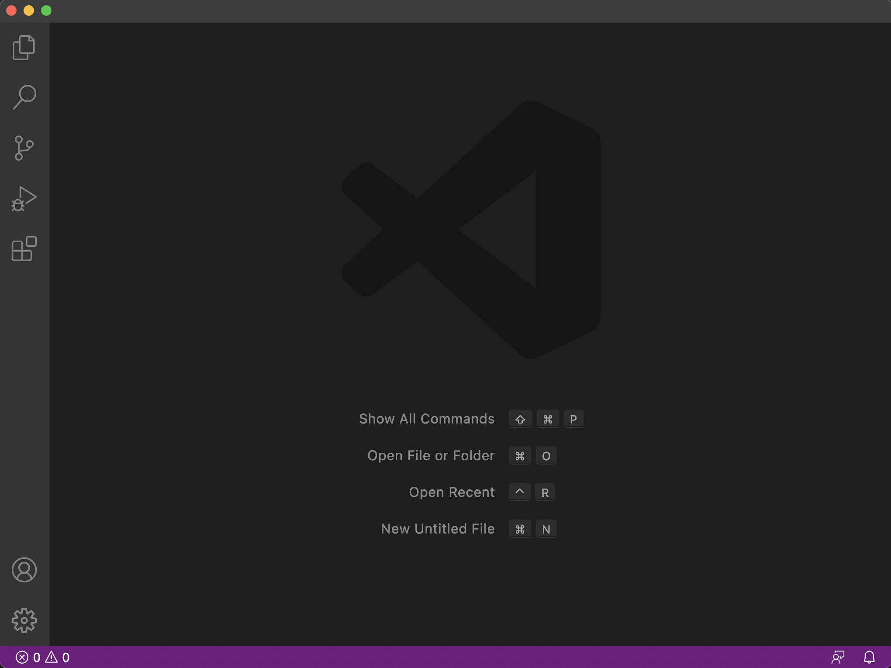

## _Step 1: Remotely Connecting_

First, open a terminal in VSCode (You can use ctrl or command + ` to have the terminal appear), or any other teminal.

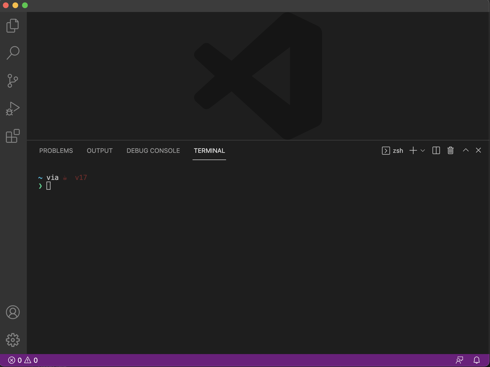

Then in the terminal type the command:

`$ ssh cs15lwi22zz@ieng6.ucsd.edu`

Before you press enter, make sure you replace the `zz` in the username with the letters in the course specfic account. 

After pressing enter, you should get a prompt that says something like this:

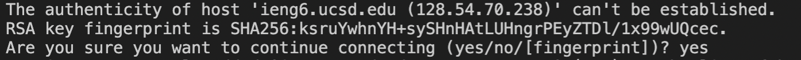

Type yes, and more messages will be generated that will look like this: 

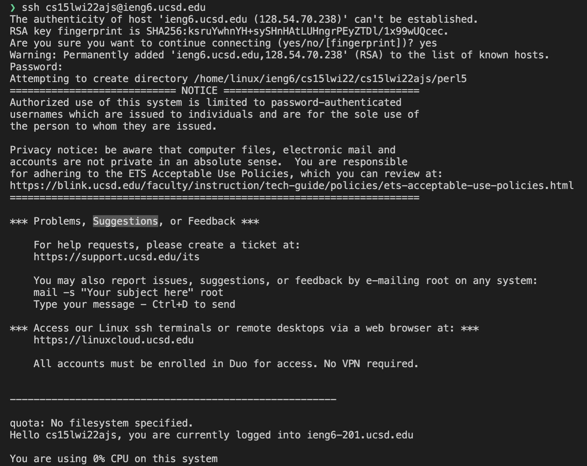
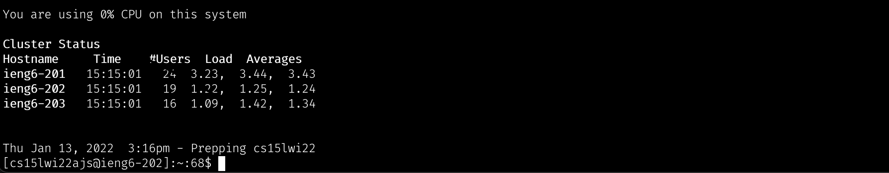

You are now logged into the remote server! 

## _Step Two: Trying Out Commands_

To ensure everything is working properly we are going to test out two commands on the remote server. The two commands we will try out is `pwd` and `ls -lat`.

When you type the command `pwd` this is what you should see in the terminal. 

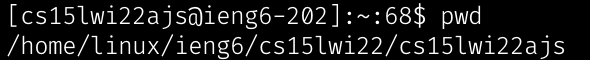

Notice how after entering the command you get a file path. This file path is referring to your current working directory. This is because `pwd` stands for print current/working directory. 

Next type `ls -lat`. You should get a simillar message as seen in the image from your terminal: 

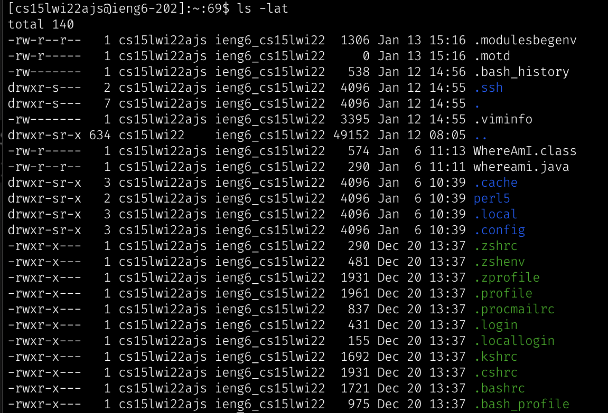

What the `ls` command does is that it lists the contents in the current directory. The letters that follow the `-` are known as flags, and are options of how the contents in the directory should be sorted. In this scenario `-lat` refers to using a long list format to list out contents including enteries that start with `.` and all enteries are sorted by modification time, with the newest time coming first.

(__Note__: Flags can be combined either by being typed out indiviudally `-l -a -t` or as seen in the example where they were altogether `-lat`)

## _Step Three: Moving Files with SCP_
A big key of working remotely is being able to copy files back and forth between computers. A way to do so is to use the command `scp`, which stands for secure copy. 

To test this command we will be using a test file called `WhereAmI.java`. The contents of the file should look like this: 

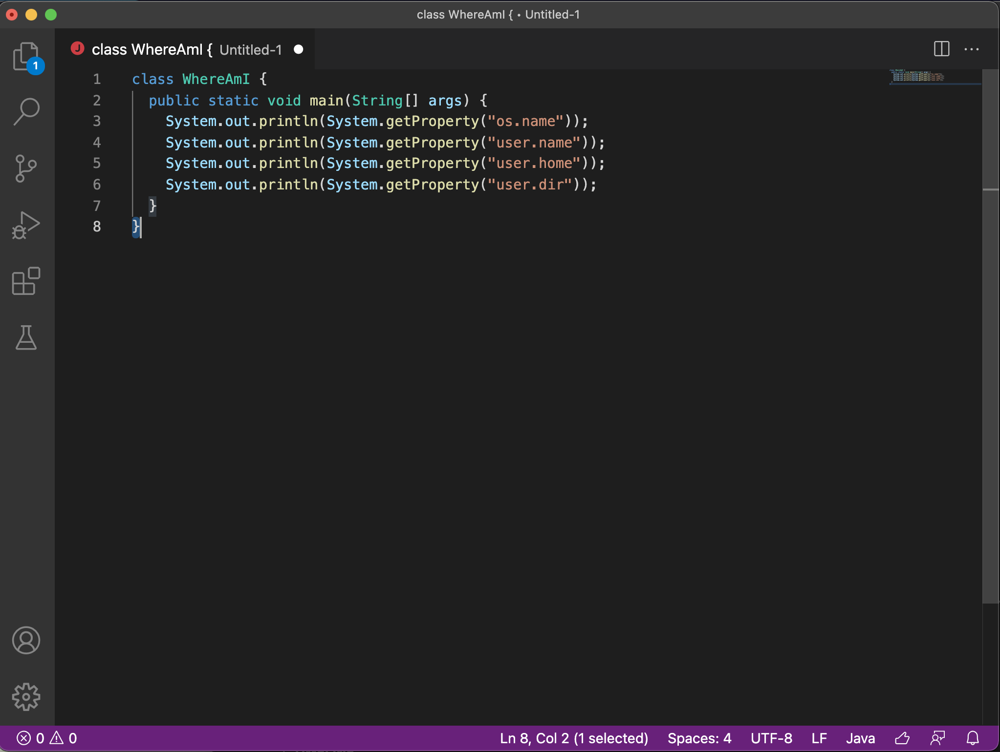

When you run the file using javac and java on the computer you should see a similar output on the terminal:

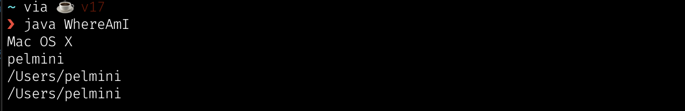

Next, in the terminal run the command (make sure you are using you're respective username):

`scp WhereAmI.java cs15lwi22zz@ieng6.ucsd.edu:~/`

Like how it was done with ssh you will be prompted for a password. You should get the following output: 

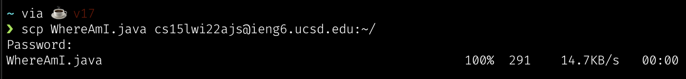

To check if the file was properly copied over use the command `ls` in your home directory of the ieng6 server and you should see the file! 

## _Step Four: Setting an SSH Key_

A way to make ssh more convenient is to generate ssh keys! By generating a ssh key we won't need to type in our password everytime we want to log in to the server. To generate a ssh key use the command `ssh-keygen`. If you already have an exsisting rsa key on your local machine, simply just make a new file to store it. You should get a similar output to this: 

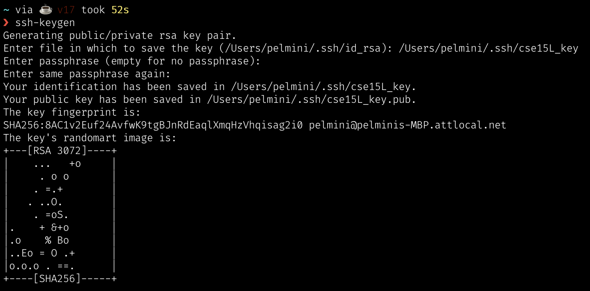

A public and private key should be created in the `.ssh` directory.

To use the key, copy the public key onto the server. This can be done by first logging into the remote server and making a `.ssh` directory by using the command  `mkdir .ssh` . Then on the local machine type the command:

`scp /Users/pelmini/.ssh/cse15L_key.pub cs15lwi22ajs@ieng6.ucsd.edu:~/.ssh/authorized_keys`

(__Note:__ Make sure to use your respective username and path)

If your file succesfully copied over you should see an output like this: 

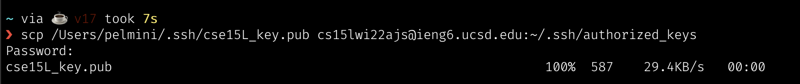

Now you should be able to login into the server without typing in your password (__Note:__ If you are like me and have multiple rsa keys on your machine, you will have to specify which key you want to use to login onto the server. This can be done by putting the flag `-i` after the ssh key command and the file path of where your private key is located. `-i` stands for identity file.)

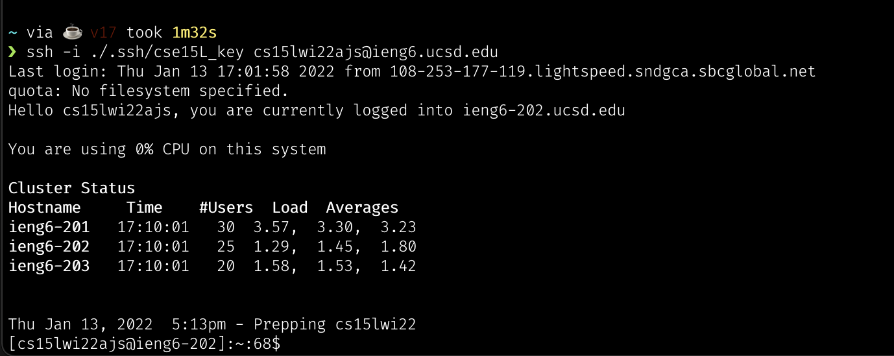

## _Step Five: Optimizing Remote Running_

Another way to optimize remote running, is that you can write commands in quotes at the end of a `ssh` command. By doing so, the command will log in to the server, run the commands in the quotes and then exit the remote server. Furthermore, if you wanted to run multiple commands on the same line you can seperate the commands by semicolons. The screen shot below shows an example.  

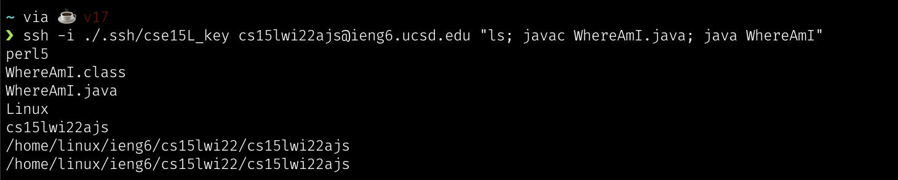
