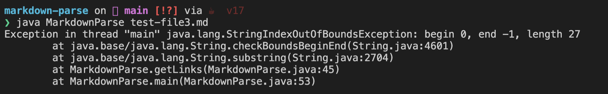

# Incremental Programming and Debugging

## _Code Change One_
[Link to Test File 9 That Caused Failure Inducing Input](https://github.com/pelmini/markdown-parse/blob/main/test-file9.md)

__Output of Running the File:__ 

__Fix Made:__ 

__Explanation:__

Although the code was able to compile with test file 9, there was a bug where it would output the path of the photo when it should only output the url of link. This is indicated of the symptom of the failure-inducing input where the path of the photo was output in the list. To fix this bug, an if statement was added to parse what is an image and what is a link in markdown. 

## _Code Change Two_
[Link to Test File 3 That Caused Failure Inducing Input](https://github.com/pelmini/markdown-parse/blob/main/test-file3.md)

__Output of Running the File:__ 

__Fix Made:__ 

__Explanation:__

The next bug I fixed was one where an exceptions out of bound was thrown. This bug was triggered because in the file there are no links (no parenethesis), and since the counter of the code relies on the int value of the index of the close parenthesis it caused the failure inducing input to trigger the expecetions out of bound symptom. To fix this error, an if-else statement was added to catch, that if the value of close parenthesis was equal to -1, then the while-loop will end and an empty list will be returned. 

## _Code Change Three_
[Link to Test File 7 That Caused Failure Inducing Input](https://github.com/pelmini/markdown-parse/blob/main/test-file7.md)

__Output of Running the File:__ 

__Fix Made:__ 

__Explanation:__

For test file 7, the symptom of the failure-inducing input was an infinite loop. This symptom is triggered because there no open parenthesis in the file, which is needed to calculate the index of the close parenthesis and the current index, and to generate the returned list from the function. To fix this bug, another condition was added to the if statement used to fix the bug from test file 3, where if the open parenthesis value is equal to -1 (it does not exist) then the while loop will end and an empty list will be returned. 
