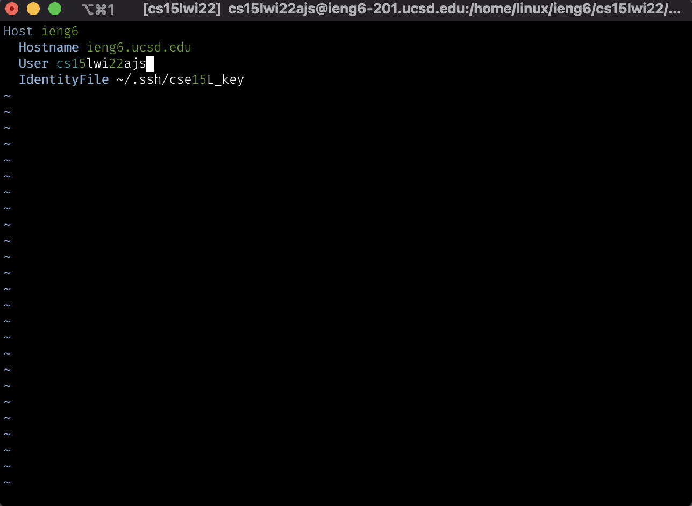
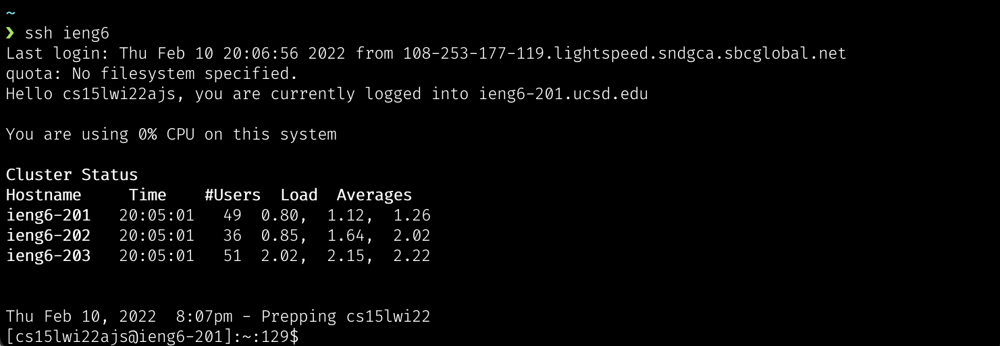
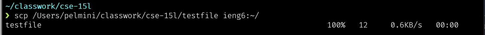
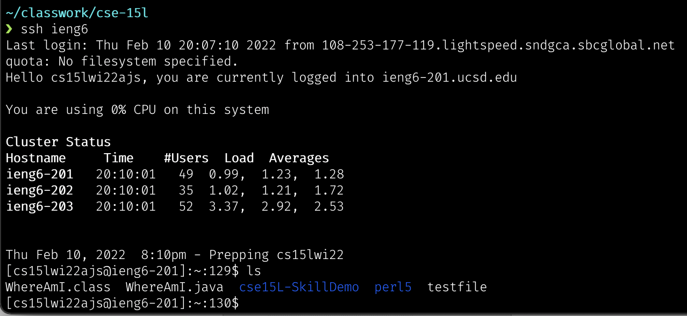

# Streamlining SSH Configuration 

Logging into a remote server with a long username can be tedious. Luckily SSH has a feature where the user can create a configuration file, that will tell SSH what username and password to use to login to the remote server. Furthermore to make things even more convinient, the user can give servers nicknames to make the whole process even easier! 

## Step One: Make Config File
To make the config file, first either open it or create it in the ```~/.ssh/config``` directory. If the file does not exist you can create it using an IDE such as VScode or a text editor like Vim. I used Vim to make mine, and added these lines:




## Step Two: Test It Out! 
If things have been setup correctly, then you would only need to type ```ssh <nickname>```, and be able to access the remote server. It should look like something like this: 



## Step Three: Try It With SCP!
The changed nickname, can also be applied when using ```scp```. Instead of typing out a long username, the new name can be used to ```scp``` a file into another server. The command will be the same, but with some slight changes. Here is an example I did with ```scp``` using a test file: 




