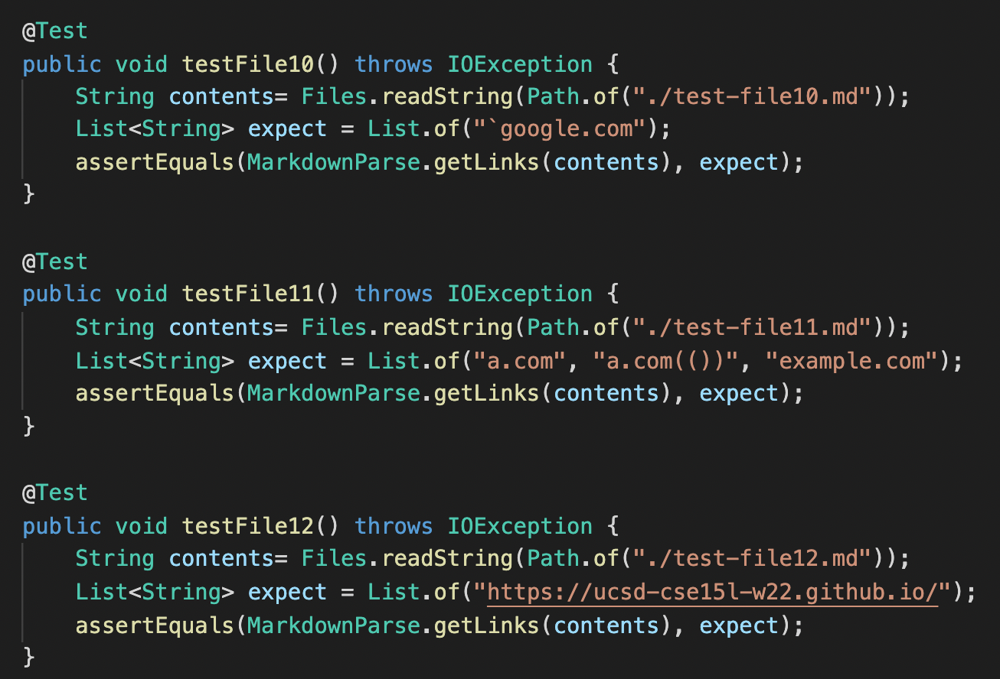
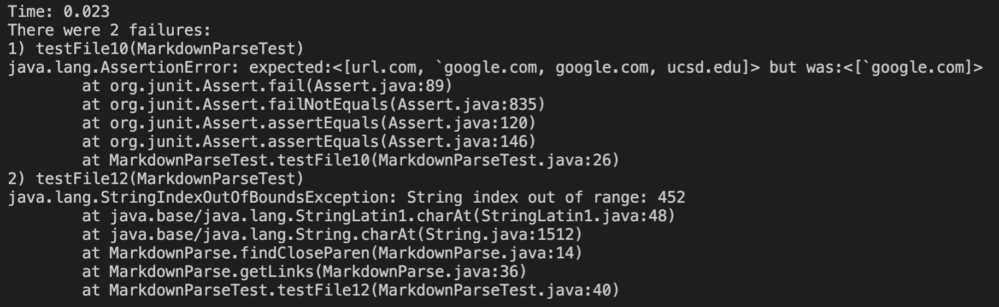
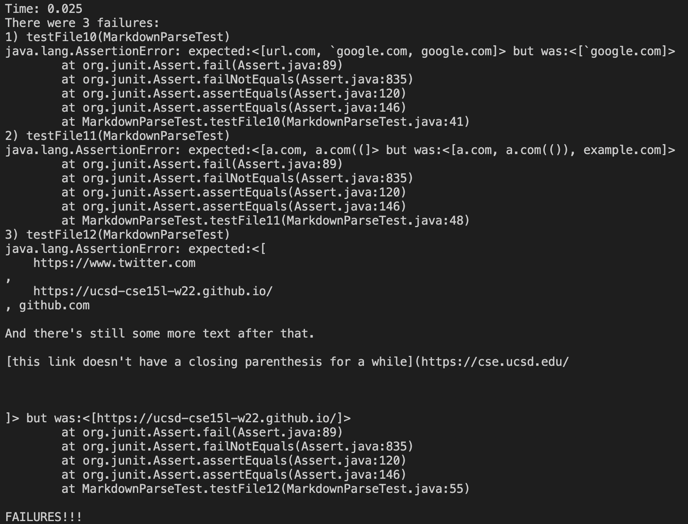

# Debuggers

## Test Code for Snippets: 

## Corresponding Output of my Implementation: 

Test for snippet two (test-file11.md)was succseful but test for snippet one and three were not (test-file10.md and (test-file12.md)). 

## Corresponding Output of Reviewed Implementation: 

No test passed. 

## Question Response: 
**Do you think there is a small (<10 lines) code change that will make your program work for snippet 1 and all related cases that use inline code with backticks? If yes, describe the code change. If not, describe why it would be a more involved change.**

*Response:*
I believe that it would be a more involved code change to make the program work for snippet 1 and all related cases that use inline code. To make the the test past with input that contain backticks either there needs to be an if statement that will enable ignoring the back tick, or the input file before hand will need to be santized from backticks which would require more than ten lines of code change. 

**Do you think there is a small (<10 lines) code change that will make your program work for snippet 2 and all related cases that nest parentheses, brackets, and escaped brackets? If yes, describe the code change. If not, describe why it would be a more involved change.**

*Response:*
I think to make snippet two work, it will only be a small line code change. This is because the original code itself counts based on parentheses. Therefore, to take in account of nested parentheses, there would just need to be slight changes of how the counter works for code that are incorrectly outputing the results of snippet 2. 

**Do you think there is a small (<10 lines) code change that will make your program work for snippet 3 and all related cases that have newlines in brackets and parentheses? If yes, describe the code change. If not, describe why it would be a more involved change.**

*Response:*
 I believe that to make my program work for snippet three and all related cases that have newlines in brackets and parenthesis, it will require a small code change. This is because in order to make it work, I think there just needs to be a slight change of how the markdown length is considered. For instance a possible solution is to add a counter for new line characters and then subtracting that from the markdown length. Such implementation should take less then 10 lines. 