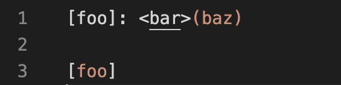
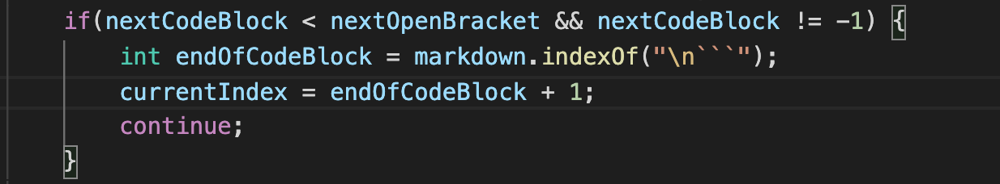
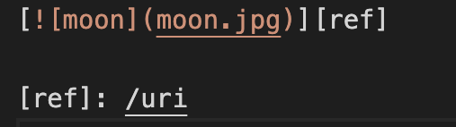
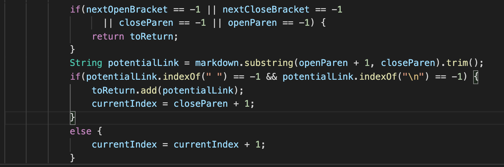

# Program Comparison 

To find the tests with different results I used the diff command on the two results.txt files I attained from running a bash for loop on the test files and their respective programs. By using the diff command, it made it easier to sort through which program output different results for the same test file. The two test files I looked at are test file 201, and test file 530. 

__Command:__ 

```diff result_cse15l.txt ~/classwork/cse-15l/markdown-parse-mine/result_mine.txt```

## Test 201
For this test, my implementation would be correct because there are no links in the test file. Although there is a bracket that is followed by () (which is the syntax for a link in markdown), the two are separated by two brackets (<>) which makes the syntax void. In order to fix this bug, there should be a condition that determines if the closed bracket and open parenthesis are next to each other. A possible solution to the bug would be taking the index of the two and subtracting them. If the difference is equal to one, then that means it is a link but if not then it is something else.
__Test File:__ 


__My Output:__ 

```[]```

__CSE 15l Output:__ 

```[baz]```

__Area to Fix:__ 



## Test 202
For this test, my implementation is incorrect as the correct output should be an array list containing moon.jpg. Since the test file contains a nested link, a way to fix this would be to refactor the conditional of how the parenthesis and brackets are counted.  

__Test File:__ 


__My Output:__ 

```[]```

__CSE 15l Output:__ 

```[moon.jpg]```

__Area to Fix:__ 

